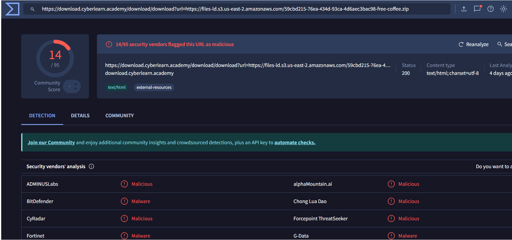
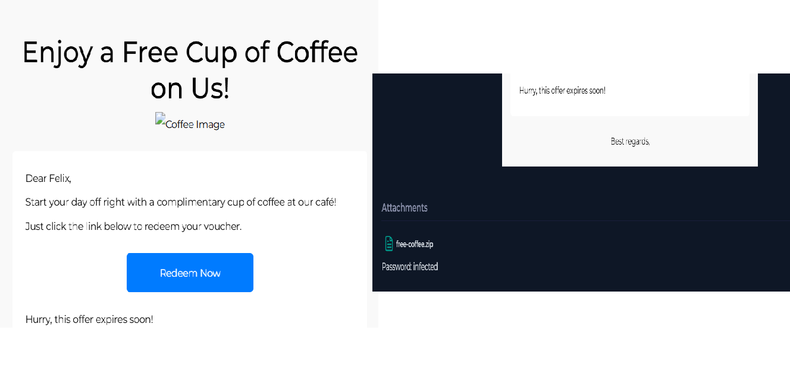
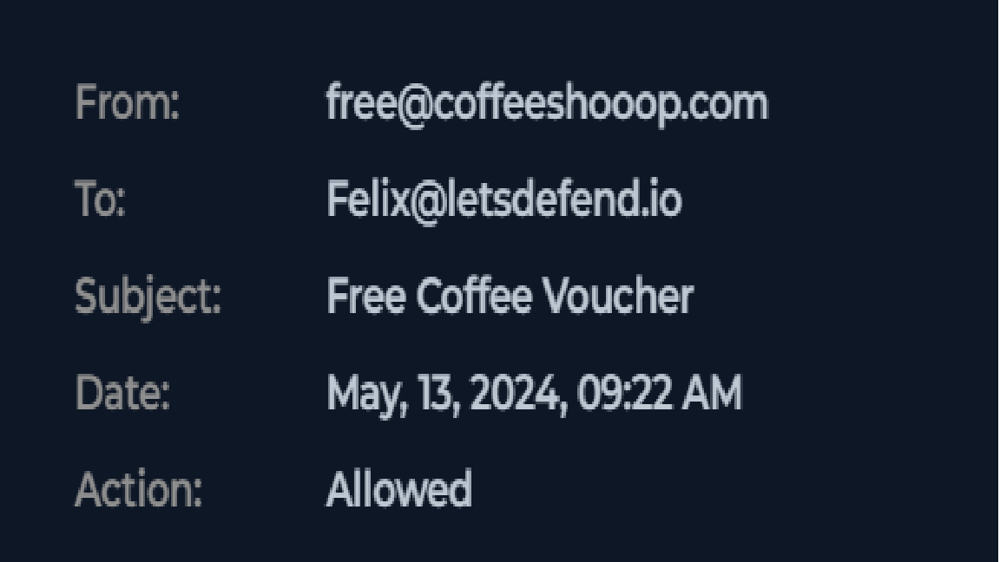

# Phishing Attack Investigation – Malicious Attachment Execution

## Summary

A phishing email was detected targeting a user (Felix). The email contained a password-protected malicious attachment, 
which the user downloaded and executed, leading to system compromise.

## Investigation Details

### Source Information
- **Sender Email:** free@coffeeshooop.com
- **Domain:** coffeeshooop.com
- **Assessment:** Suspicious (typosquatting + phishing indicators)

### Target Information
- **User:** Felix
- **Device IP:** 172.16.x.x
- **Platform:** Endpoint (Windows system)

## Email Analysis

The email contained a password-protected ZIP attachment (free-coffee.zip) with the password provided in the message. 
This is a common evasion technique used to bypass email security filters.

The domain “coffeeshooop.com” mimics a legitimate domain using extra characters, indicating a typosquatting attempt. 
The email also used urgency to entice the user into opening the attachment.

## Endpoint Analysis

Browser history confirms the user downloaded the attachment from an external source.

### Process analysis shows the following sequence:

- 7zG.exe used to extract the ZIP file
- Coffee.exe executed from the Downloads directory
- Coffee.exe spawned cmd.exe, indicating execution of system-level commands

This confirms that the malicious file was executed on the host.

## Findings

- A phishing email containing a malicious attachment was delivered to the user
- The attachment was password-protected to evade detection
- The user downloaded and extracted the file
- A suspicious executable (Coffee.exe) was executed
- The process spawned cmd.exe, indicating malicious activity
- The system was successfully compromised

## Conclusion

This incident is confirmed as a phishing attack that resulted in successful malware execution. 
The user executed a malicious attachment, leading to system compromise.

## Recommendations

- Isolate the affected host from the network
- Remove malicious files and perform full system scan
- Reset user credentials
- Educate users on phishing and suspicious attachments
- Block the malicious domain and related indicators
- Implement email filtering for suspicious attachments

## Evidence

### VirusTotal

### Email 

### Domain

