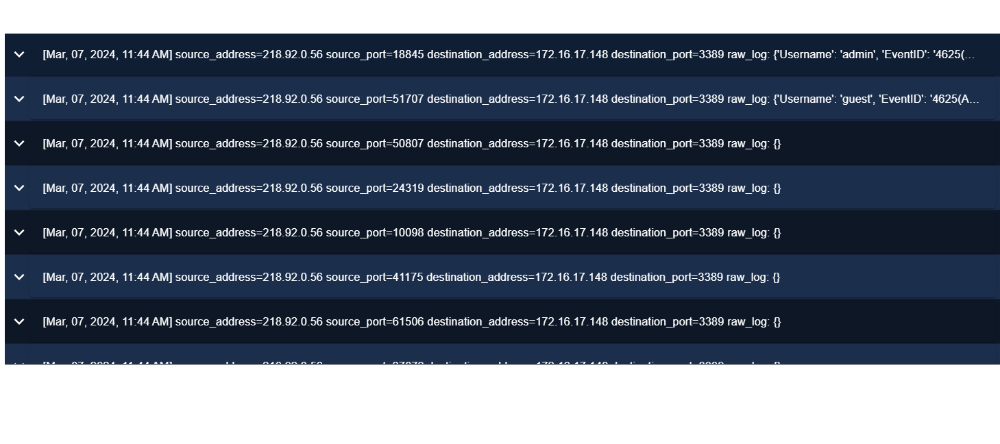
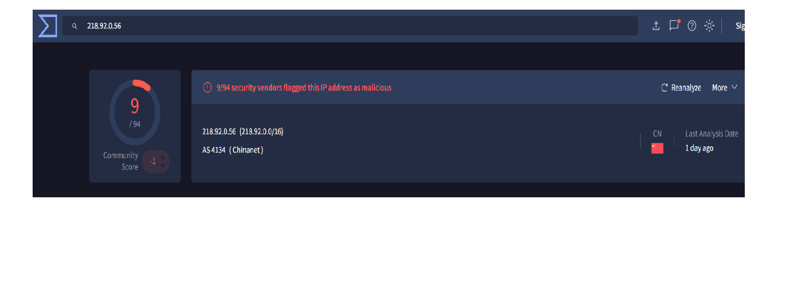
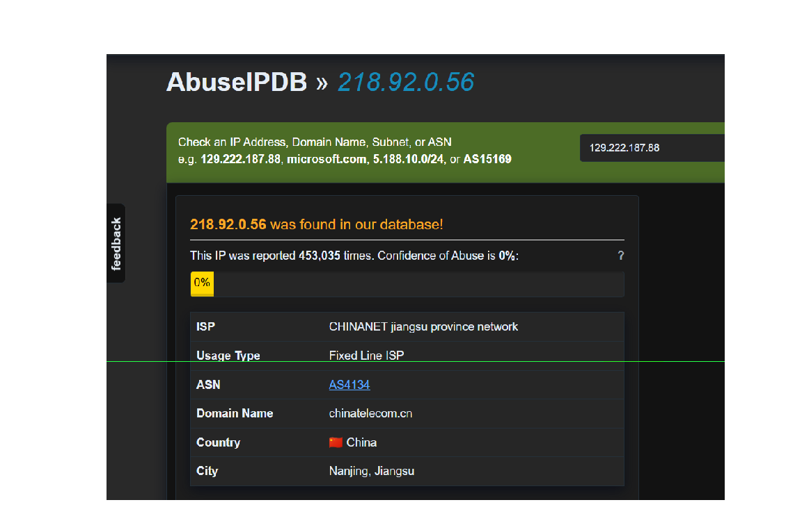

# RDP Brute Force Attack Investigation

## Summary
A brute force attack was detected targeting an internal host (172.16.17.148) over Remote Desktop Protocol (RDP) on port 3389. Multiple login attempts originated from a single external IP address (218.92.0.56).

---

## Investigation Details

### Source Information
- **Source IP:** 218.92.0.56  
- **Location:** External  
- **Reputation:** Flagged as malicious on VirusTotal and AbuseIPDB  

### Destination Information
- **Destination IP:** 172.16.17.148  
- **Hostname:** Matthew  
- **Service Targeted:** RDP (Port 3389)

---

## Log Analysis
Log data shows repeated connection attempts from the same source IP address using different source ports. This indicates multiple authentication attempts within a short period.

The consistent targeting of port 3389 confirms that the attacker was attempting to gain access via Remote Desktop Protocol.

Further analysis identified Event ID 4624, which indicates a successful login event following multiple failed attempts.

---

## Findings
- A single external IP performed multiple login attempts against an internal host  
- The attack targeted RDP (port 3389)  
- The source IP has a known malicious reputation  
- Evidence suggests a successful login occurred after repeated attempts  

---

## Conclusion
This activity is confirmed as a brute force attack against the target system via RDP.

---

## Recommendations
- Block the malicious IP address (218.92.0.56).
- isolate the affected host (172.16.17.148) from the network to prevent further compromise.
- Implement account lockout policies after multiple failed login attempts.
- Enforce strong password policies. 
- Restrict or secure RDP access (e.g., VPN or multi-factor authentication)  
- Continuously monitor authentication logs for suspicious activity.

## Evidence

### Log Evidence

### VirusTotal Analysis

### AbuseIPDB Analysis

### Successful Login Evidence

