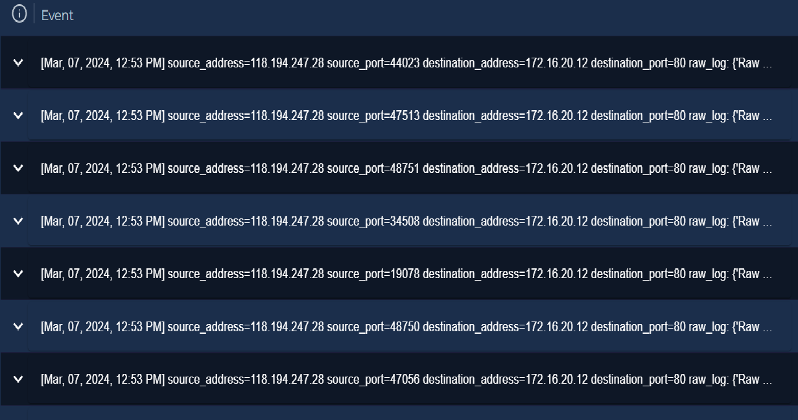
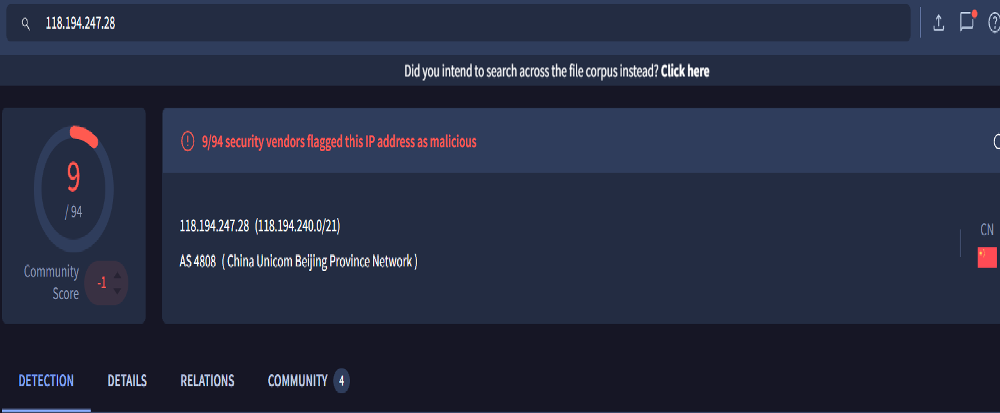
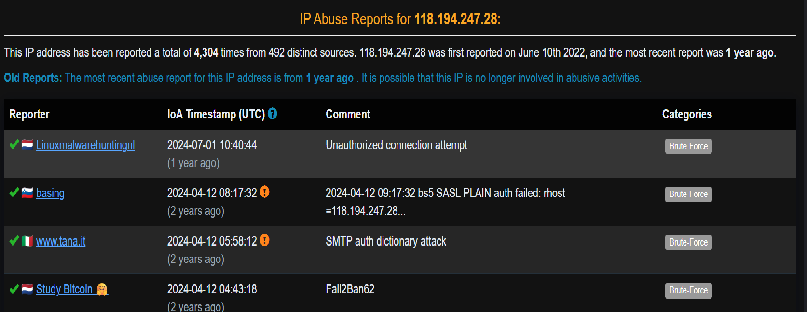

# SQL Injection Attack Investigation

## Summary

An automated SQL injection attack was detected targeting a web application hosted on an internal server. The attack originated from an external malicious IP address (118.194.247.28), 
which is known for abuse and scanning activity according to threat intelligence sources such as VirusTotal and AbuseIPDB.
The attacker used the sqlmap tool to attempt exploitation of the id parameter in a GET request on /index.php, targeting the web service running on port 80.

---

## Investigation Details

### Source Information
- Source IP: 118.194.247.28
- Location: External (public internet)
- Reputation: Flagged as malicious (VirusTotal, AbuseIPDB)
- Tool Used: sqlmap 1.7.2 (automated SQL injection framework)
  
 ### Destination Information
- Destination IP: 172.16.20.12
- Service Targeted: HTTP (Port 80)
- Application: Web server hosting /index.php

---

## Log Analysis

Log evidence shows multiple HTTP GET requests directed to /index.php with manipulated id parameters containing SQL injection payloads. 
The attacker systematically tested different injection patterns, including boolean-based and blind SQL injection techniques.
The payloads include encoded SQL statements designed to bypass input validation and interact with the backend database. 
One of the requests indicates the use of Oracle-specific functions such as DBMS_PIPE.RECEIVE_MESSAGE, suggesting advanced blind SQL injection attempts.
All requests received HTTP 200 responses, indicating that the web server successfully processed the requests and forwarded them to the application layer. 
The consistent responses suggest that the input was not blocked or rejected at the web server level.

---

## Findings
- A single external IP conducted automated SQL injection testing using sqlmap
- Multiple injection payloads were observed targeting the id parameter
- The application consistently returned HTTP 200 responses, indicating successful request processing
- No evidence of server errors or blocked requests was observed in logs
- The attacker was able to successfully interact with the backend database layer, confirming SQL injection vulnerability
- No direct evidence of data exfiltration is visible in the provided logs

---

## Conclusion

This activity is confirmed as a successful SQL injection exploitation attempt against the web application. 
Although no explicit data extraction is visible in the logs, the successful execution of injection payloads and interaction with the backend database layer
confirms that the application is vulnerable.
The incident requires escalation to Tier 2 / Incident Response team for further forensic analysis to determine the extent of compromise
and potential data exposure.

---

Recommendations
- Sanitize and validate all user inputs (especially id parameter)
- Implement prepared statements / parameterized queries
- Deploy a Web Application Firewall (WAF) to detect SQL injection patterns
- Block malicious IP address (118.194.247.28) at perimeter defenses
- Monitor for repeated sqlmap-like behavior and automated scanning tools
- Conduct full application security review and penetration testing
- Enable detailed database query logging for future investigations

---

## Evidence
### Log Evidence

### Threat Intelligence

