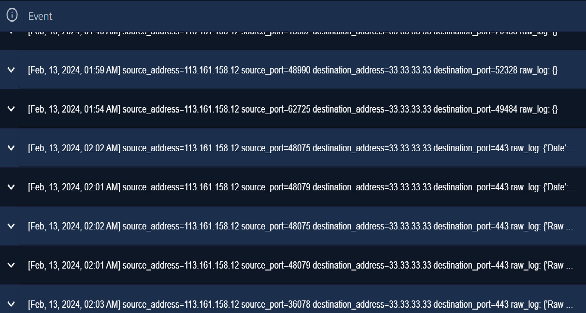
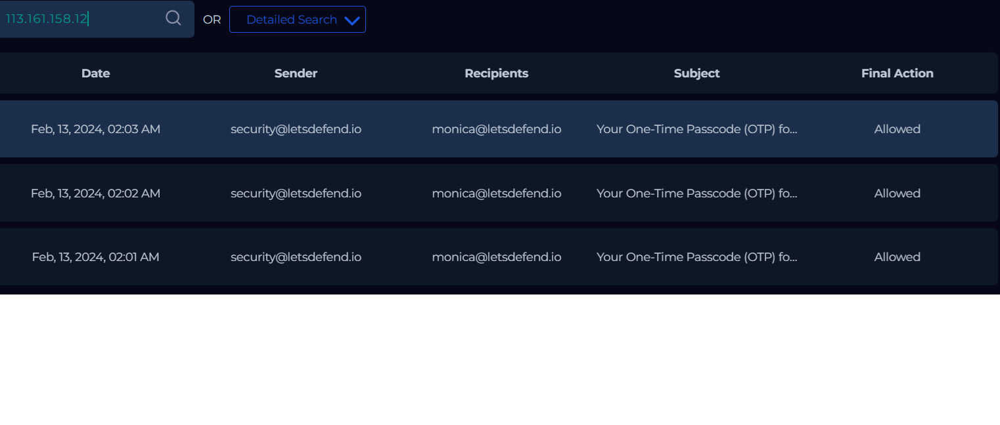

# VPN Brute Force Attack Investigation

## Summary

A brute force attack was detected targeting a VPN account associated with an internal user (Monica). Multiple authentication attempts originated from an external IP address (113.161.158.12), 
triggering repeated OTP (MFA) requests.

---

## Investigation Details

### Source Information
- **Source IP:** 113.161.158.12
- **Location:** Hanoi, Vietnam
- **Reputation:** Flagged for brute force activity (Threat Intelligence)

### Destination Information

- **Destination IP:** 33.33.33.33 (VPN Service)
- **Internal Device:** 172.16.17.163
- **Hostname:** Monica
- **Service Targeted:** HTTPS (Port 443) / VPN Login Portal

## Log Analysis

Log data shows the attacker initially attempted connections across multiple destination ports, indicating reconnaissance activity.

The attacker then focused on port 443, which is commonly used for secure web services, including VPN portals.

Repeated connections to port 443 from varying source ports suggest sustained interaction with the VPN login interface.

Additionally, multiple OTP emails were generated within short intervals, confirming repeated authentication attempts after successful password entry.

---

## Findings
- A single external IP performed multiple connection attempts
- Initial port scanning was followed by targeted access to port 443
- The attacker triggered multiple OTP requests, indicating valid credentials were likely obtained
- MFA successfully prevented unauthorized access
- No evidence of successful login or system compromise

---

## Conclusion

This activity is confirmed as a brute force attack targeting a VPN account. Although the attacker likely obtained valid credentials,
Multi-Factor Authentication (MFA) prevented successful access to the system.

---

## Recommendations

Reset the affected user’s password immediately
Enforce stronger password policies
Monitor for repeated login attempts from suspicious locations
Block or restrict the malicious IP address (113.161.158.12)
Implement account lockout mechanisms after multiple failed attempts
Continue enforcing MFA across all remote access services

---

## Evidence

## Log Evidence

## Email Evidence

## Threat Intelligence

